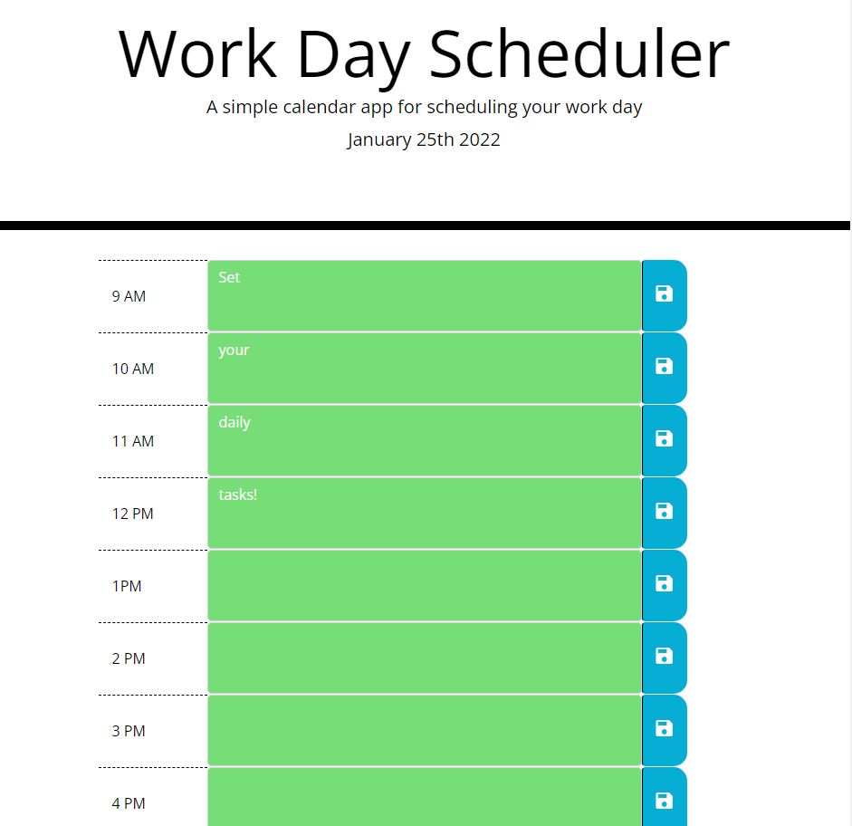

# code-quiz 

## This webpage was created using JavaScript, HTML and CSS.

## Usage

This daily planner is intended to assist in time management.  When you open the planner you will be presented with the current day at the top.  If you scroll down, you will see blocks of time for standard business hours.  You will see color-coding on the time blocks to indicate if the event is present, in the past, or in the future.  When you click on a time block you will be able to enter the time slot and save the content for use later.  

Click this [LINK](https://kstensing.github.io/work-day-scheduler/) for the landing page.

The application should resemble the image below: 

## License

Licensed under the [MIT](LICENSE.txt) license.

